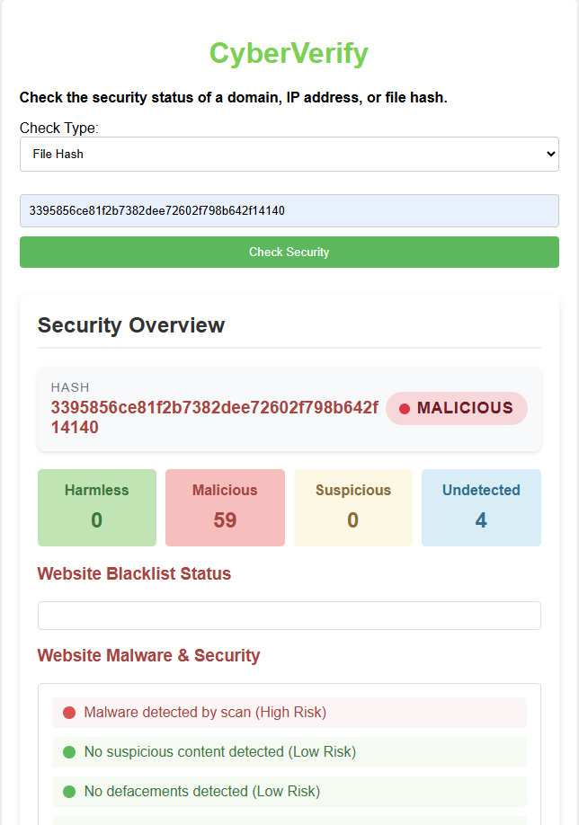

# CyberVerify

A web application that checks the security status of domains, IP addresses, and file hashes using the VirusTotal API.

🔗 [Live Demo](https://cyberverify-56a09187d970.herokuapp.com/)  
🔗 [Source Code](https://github.com/Dimplektech/CyberVerify)


## Features

- **Domain Security Analysis**: Check if domains are safe, suspicious, or malicious
- **IP Address Reputation Checks**: Verify the security status of IP addresses
- **File Hash Verification**: Analyze file hashes against VirusTotal's database
- **Comprehensive Reports**: Get detailed security information from multiple security vendors
- **User-Friendly Interface**: Clear visual indicators of security status


## Example Results

### Safe Domain Check


### Safe Hash Check



### Safe Ip Check


## Technology Stack

- **Backend**: Flask (Python)
- **Frontend**: HTML, CSS, JavaScript (Vanilla)
- **API Integration**: VirusTotal API v3
- **Validation**: Pydantic for strong input validation
- **Deployment**: Heroku

## Getting Started

### Prerequisites

- Python 3.9 or higher
- A VirusTotal API key (get one at [VirusTotal](https://www.virustotal.com/))

### Installation

1. Clone the repository:
   ```
   git clone https://github.com/Dimplektech/CyberVerify.git
   ```

2. Create a virtual environment:
   ```
   python -m venv venv
   venv\Scripts\activate  # On Windows
   # OR
   source venv/bin/activate  # On macOS/Linux
   ```

3. Install dependencies:
   ```
   pip install -r requirements.txt
   ```

4. Create a .env file in the project root:
   ```
   VIRUSTOTAL_API_KEY=your_api_key_here
   ```

5. Run the application:
   ```
   python api.py
   ```

6. Access the application at `http://localhost:5000`

## Usage

1. Select a check type from the dropdown (Domain, IP Address, or File Hash)
2. Enter the value to check
3. Click "Check Security"
4. View the security report with overall status and detailed vendor information

### Example Inputs:

- **Domain**: google.com, microsoft.com
- **IP Address**: 8.8.8.8, 1.1.1.1
- **File Hash**: 44d88612fea8a8f36de82e1278abb02f (MD5 of EICAR test file)


## Deployment
The application is deployed on Heroku at: [https://cyberverify-56a09187d970.herokuapp.com/](https://cyberverify-56a09187d970.herokuapp.com/)


To deploy your own instance:

1. Create a [Heroku](https://www.heroku.com/) account
2. Install the Heroku CLI
3. Login and create a new app:
   ```
   heroku login
   heroku create your-app-name
   ```
4. Set your VirusTotal API key:
   ```
   heroku config:set VIRUSTOTAL_API_KEY=your_api_key_here
   ```
5. Deploy:
   ```
   git push heroku main
   ```

## Security Considerations

- API keys are stored as environment variables, never in code
- All user inputs are thoroughly validated
- HTTPS is enforced for all communications
- No user data is stored or logged

## Limitations

- The free VirusTotal API has rate limits (4 requests/minute)
- Some advanced features require a premium VirusTotal subscription
- The application only checks what's known to VirusTotal's database

## Contributing

Contributions are welcome! Please feel free to submit a Pull Request.

1. Fork the repository
2. Create your feature branch (`git checkout -b feature/amazing-feature`)
3. Commit your changes (`git commit -m 'Add some amazing feature'`)
4. Push to the branch (`git push origin feature/amazing-feature`)
5. Open a Pull Request


## Acknowledgements

- [VirusTotal](https://www.virustotal.com/) for providing the security API
- [Flask](https://flask.palletsprojects.com/) web framework
- [Pydantic](https://docs.pydantic.dev/) for data validation

---

